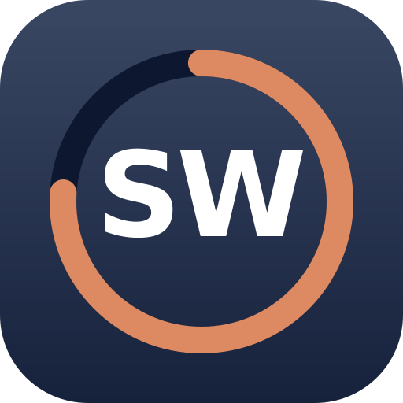
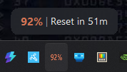
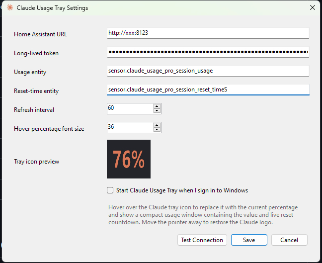

<p align="center">
  
</p>

# Claude Usage Taskbar

A lightweight Windows system tray app that shows your Claude (Anthropic) usage at a glance, powered by Home Assistant.

Hover the Claude logo in the notification area and it swaps to your current session usage percentage, with a compact popup showing a live countdown to your next reset:

Move the pointer away and the Claude logo returns. No dashboards, no browser tabs, no surprise "you've reached your limit" walls mid-task.

<p align="center">
  
</p>

## Features

- **Unobtrusive by default** — the tray icon is just the Claude logo until you hover it
- **Hover to reveal** — the icon becomes your current usage percentage, drawn live with a configurable font size
- **Live reset countdown** — the hover popup ticks down in real time (`Reset in 3h 24m` → `Reset in 42m` → `Reset due`)
- **Single-click refresh** — manually pull the latest values from Home Assistant, with a spinner so you know it's working
- **Right-click menu** — quick links to open Claude and Home Assistant, plus Settings and Exit
- **Automatic background refresh** — polls Home Assistant at a configurable interval (default 60s)
- **Flexible reset parsing** — handles ISO date/times, Unix timestamps, time of day, `TimeSpan`, or plain text like `3h 24m`
- **Secure token storage** — your Home Assistant token is encrypted at rest with Windows DPAPI, never stored in plain text
- **Start with Windows** — optional launch at sign-in
- **Single portable exe** — self-contained publish, no .NET runtime install required

<p align="center">
  
</p>

## How it works

```text
Anthropic usage API  →  hass-claude-usage (HACS)  →  Home Assistant sensors  →  Claude Usage Tray
```

The app reads two sensors from Home Assistant's REST API:

| Sensor | Purpose |
| --- | --- |
| `sensor.claude_usage_session_usage` | Current 5-hour session usage (%) |
| `sensor.claude_usage_session_reset_time` | When the session limit resets |

These are provided by [trickv/hass-claude-usage](https://github.com/trickv/hass-claude-usage), a HACS integration that polls Anthropic's usage API via OAuth. Your entity IDs may differ depending on how the integration named them — both are configurable in Settings.

> [!WARNING]
> Anthropic rate limits the usage API. Keep the integration's polling interval at its default (300s). Hitting it too aggressively can lock you out of usage data everywhere, including claude.ai, for around 24 hours.

## Requirements

- Windows 10 or 11, 64-bit
- Home Assistant reachable from the Windows PC
- [hass-claude-usage](https://github.com/trickv/hass-claude-usage) installed and configured in Home Assistant
- A Home Assistant [long-lived access token](https://developers.home-assistant.io/docs/auth_api/#long-lived-access-token) (Profile → Security)

To build from source you'll also need the .NET 8 SDK and access to NuGet.org. The published executable itself has no dependencies.

## Building

Close any running instance, then from PowerShell in the project folder:

```powershell
Set-ExecutionPolicy -Scope Process Bypass
.\publish-win-x64.ps1
```

The self-contained executable is written to:

```text
publish\win-x64\ClaudeUsageTray.exe
```

Drop it wherever you like and run it. Settings migrate automatically from earlier versions.

## Setup

1. Run `ClaudeUsageTray.exe` — the Claude logo appears in the notification area
2. Right-click the icon → **Settings**
3. Enter your Home Assistant URL (e.g. `http://homeassistant.local:8123`) and long-lived token
4. Confirm or adjust the usage and reset-time entity IDs
5. Hit **Test Connection**, then **Save**

Optionally tick **Start Claude Usage Tray when I sign in to Windows**.

## Tray controls

| Action | Behaviour |
| --- | --- |
| Hover | Icon swaps to current percentage; popup shows usage and live reset countdown |
| Move away | Popup closes, Claude logo restored |
| Single left-click | Manual refresh (spinner shows for at least 2 seconds) |
| Right-click | Context menu: Open Claude, Open Home Assistant, Settings, Exit |
| Background | Automatic refresh at the configured interval, no spinner |

## Tech notes

- .NET 8, WinForms, published as a single self-contained win-x64 executable
- Tray percentage icon is rendered on the fly with GDI+ (hence the configurable font size)
- Home Assistant token encrypted per-user via DPAPI (`CryptProtectData`)
- Two GET requests to `/api/states/<entity_id>` per refresh — that's the entire API footprint

## Credits

- [trickv/hass-claude-usage](https://github.com/trickv/hass-claude-usage) for the Home Assistant integration this app depends on
- Claude and the Claude logo are property of Anthropic; this is an unofficial personal tool and is not affiliated with Anthropic

## License

See [LICENSE](LICENSE).
